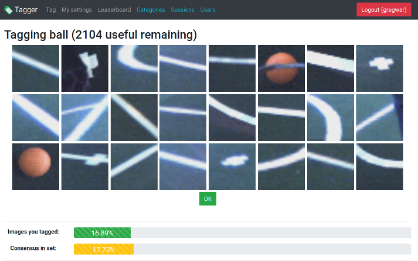

# Rhoban patches tagger

## Introduction

The tagger is a tool allowing you to upload several patches (small images) and tag them under some categories in order to train neural networks



## Installing

### Cloning and getting dependencies

The current version is based on the Symfony framework and require a MySQL database.

First, clone this repository and run the [composer installation](https://getcomposer.org/):

    git clone https://github.com/Rhoban/tagger.git
    cd tagger
    composer install

*Note: composer can be obtained on [getcomposer.org](https://getcomposer.org/) or via `apt install composer` on a debian installation*

### Configuring the database

You then need to configure the app, edit the `.env` file and change the `DATABASE_URL` so that it matches your database configuration.

You can now create the database schema using:

    ./bin/console doctrine:schema:create

### Getting the first administrator

You can now deploy and run the application (reaching the Symfony `public/` directory from your web server supporting PHP), and register your first account.

To promote the first admin, you can use the Friends Of Symfony command line:

    ./bin/console fos:user:promote

And then enter the username, and `ROLE_ADMIN` like this:

    Please choose a username: gregwar
    Please choose a role: ROLE_ADMIN

You might need to logout and login again to have this taking effect.

## Using

### Managing categories

First, you need to create `categories`, log in on any admin account and click on the category menu on the top.

The categories are basically things that you want to tag. In our robots at the RoboCup we tag for instance balls and goal posts.

### Sessions and sequences

Next, you need to upload log sessions that you want to tag. A session can be any way of separating your batches of patches. A session contain several sequences that are typically shot sequentially, and can be used to know where each patch come from more accurately.

For example:

* Sesion 1: "Training field at our lab"
    * Sequence 1: "Robot 1 at 10:01"
    * Sequence 2: "Robot 1 at 10:09"
    * Sequence 3: "Robot 2 at 10:12"
* Session 2: "Field A at RoboCup 2017"
    * Sequence 1: "Robot 1 at 12:31"
    * Sequence 2: "Robot 2 at 12:45"

Thus, we can for instance disable the session that was using for training at our lab when we want only to tag the patches at the competition. Moreover, we can also remove sequences from the Robot 1 if we note that there was a big mistake in the patch extraction.

To create sequence, you need to upload patches using the upload process

### Uploading

The archive can have any structure, as long as it ends with directories with categories names, like:

```
robot1/
    17h59/
        goal/
            1.png
            2.png
            3.png
        ball/
            1.png
            2.png
            3.png
    18h05
        goal/
            1.png
            2.png
            3.png
```

Will result in having two sequences, one named `robot1_17h59` containing patches for `goal<` category and patches for `ball` category, and one named `>robot1_18h05` containing patches for `goal` category.

*Note: if you want to have the progress bar to work, you have to enable the `session.upload_progress.enabled` in the PHP configuration*

### Training

This feature is optional, add `TRAINING=1` in the .env file to enable it.

When fresh users registers, they are marked as not trained, meaning that they are not allowed to tag unless they completed a training session.

To achieve this:

* Tick the "training" box when editing sessions that you want to include in the process of training new users
* Tag the images from these sessions
* You can, if you want, disable these sessions so they are not in the standard tag process (and let the training flag)

*Notes: admin doesn't need to be trained, it is also possible to manually mark someone as trained in the administration of users.*
